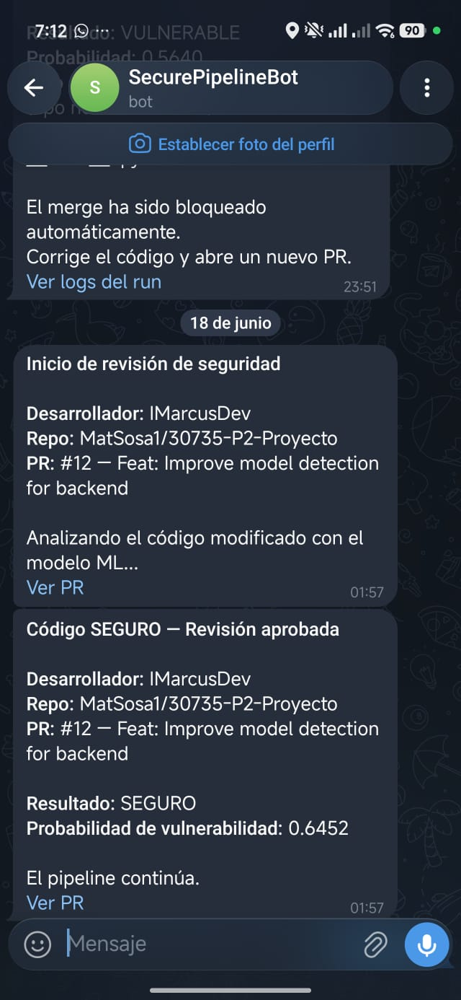

# Pipeline CI/CD Seguro con Detección de Vulnerabilidades por Minería de Datos

Proyecto Integrador Parcial II — Desarrollo de Software Seguro (ESPE).

Pipeline CI/CD que aplica **Shift-Left Security**: cada Pull Request de `dev → test`
es analizado por un modelo de **minería de datos clásico** (scikit-learn) que
clasifica el código modificado como **SEGURO** o **VULNERABLE**. Solo el código
clasificado como seguro puede avanzar hacia producción.

> **Sin LLM.** La clasificación se realiza exclusivamente con un modelo de
> machine learning tradicional (TF-IDF + Regresión Logística). No se utiliza
> ningún Large Language Model en ninguna etapa.

---

## 1. Arquitectura y flujo de ramas

```text
dev   → Desarrollo (el desarrollador hace push aquí)
test  → Staging / Pruebas (PR dev→test dispara la revisión de seguridad)
main  → Producción (despliegue automático)
```

El pipeline (`.github/workflows/model_detector.yml`) se activa al abrir un
**Pull Request hacia `test`** y ejecuta:

1. **Descarga del diff** — `pipeline/check_diff_files.py` obtiene los archivos
   añadidos/modificados bajo `src/` entre el commit base y el head del PR
   (`git diff --name-status`).
2. **Clasificación con el modelo** — `pipeline/model_load.py` carga
   `vuln_model/vulnerability_detector.pkl` y predice la probabilidad de
   vulnerabilidad de cada archivo. Si supera el umbral de decisión se marca
   como VULNERABLE.
3. **Tipo de vulnerabilidad** — para los archivos vulnerables,
   `pipeline/vuln_type.py` etiqueta el CWE probable (heurística para la
   notificación; no forma parte de la clasificación del modelo).
4. **Notificaciones Telegram** — inicio de revisión, resultado SEGURO o
   resultado VULNERABLE con probabilidad, tipo y archivo afectado.
5. **Bloqueo del merge** — si algún archivo es vulnerable, el job termina con
   `exit 1` y el merge queda bloqueado.

---

## 2. Modelo de minería de datos

### 2.1. Datasets (públicos)

| Dataset | Fuente | Aporte |
|---|---|---|
| Vulnerability Fix Dataset | [Kaggle](https://www.kaggle.com/datasets/jiscecseaiml/vulnerability-fix-dataset) | Pares `vulnerable_code` / `fixed_code` (XSS, SQLi, Command Injection, Path Traversal, Buffer Overflow, Deserialización) |
| Devign (processed) | [HuggingFace](https://huggingface.co/datasets/nuojohnchen/devign-processed) | Funciones C reales de FFmpeg/QEMU etiquetadas como vulnerables/seguras |

Dataset unificado: **91.854 funciones** balanceadas (≈46.836 vulnerables /
45.018 seguras).

### 2.2. Features (extraídas en el notebook)

La representación combina, mediante un `FeatureUnion`, dos bloques:

- **Tokens del código** — `TfidfVectorizer` con un `token_pattern` que conserva
  puntuación de código (`==`, `&&`, `()`, `;`, etc.), n-gramas 1–2,
  `max_features=20000` y `sublinear_tf=True`.
- **Features de seguridad** (`pipeline/security_features.py`) — señales
  interpretables exigidas por la rúbrica:
  - Llamadas a funciones peligrosas: `eval`, `exec`, `os.system`,
    `subprocess(shell=True)`, `pickle.loads`, `yaml.load`, `md5/sha1`,
    `gets/strcpy/sprintf`, etc.
  - SQL sin parametrizar (concatenación con `+`, `.format`, f-strings).
  - Presencia de **sanitización**: queries parametrizadas, `bcrypt/argon2`,
    `escape/sanitize`, `os.path.basename`, formas seguras de `subprocess`.
  - Longitud normalizada del fragmento.
  - **Profundidad estructural** (proxy de *AST depth*, agnóstico al lenguaje:
    anidamiento de paréntesis/llaves e indentación).

### 2.3. Clasificador

`LogisticRegression(class_weight="balanced", C=1.0, max_iter=1000)` de
scikit-learn, serializado con `joblib` en `vuln_model/vulnerability_detector.pkl`
con la forma `{"vectorizer": FeatureUnion, "model": LogisticRegression}`.

### 2.4. Resultados (validación cruzada)

**Accuracy en validación cruzada 5-fold: `0.9084` (± 0.0015)** — supera el
mínimo exigido del 82 %.

```text
5-fold CV accuracy: [0.9066 0.9078 0.9080 0.9111 0.9087]   media = 0.9084
```

Sobre el conjunto de prueba (25 % held-out):

```text
Accuracy: 0.9100

              precision    recall  f1-score   support
       False     0.9133    0.9020    0.9076     11255
        True     0.9069    0.9177    0.9123     11709
    accuracy                         0.9100     22964
```

### 2.5. Análisis de errores y límites

Más allá de la métrica del dataset, se evaluó el modelo sobre una batería
independiente de 34 fragmentos realistas (Python/Java/C++). El modelo es fiable
para inyecciones por construcción de strings, pero tiene falsos negativos en
patrones cuya señal es estructural y no léxica (path traversal, crypto débil,
SSRF).

### 2.6. Reproducir el entrenamiento

El notebook `vuln_model/30735_P2_Proyecto_Pipeline.ipynb` descarga los datasets,
construye las features, entrena el modelo, reporta las métricas y serializa el
`.pkl`. Puede ejecutarse en Google Colab o localmente:

```bash
pip install -r requirements.txt pandas matplotlib seaborn kagglehub datasets jupyter
jupyter nbconvert --to notebook --execute --inplace \
  vuln_model/30735_P2_Proyecto_Pipeline.ipynb
```

---

## 3. Setup del pipeline

### 3.1. Secrets requeridos (GitHub → Settings → Secrets and variables → Actions)

| Secret | Descripción |
|---|---|
| `TELEGRAM_TOKEN` | Token del bot de Telegram propio (BotFather) |
| `TELEGRAM_TO` | Chat ID destino de las notificaciones |

### 3.2. Branch protection rules

Configurar en **Settings → Branches** para `test` y `main`:

- Requerir que el check **"Check Vulnerabilities"** pase antes de hacer merge.
- Requerir Pull Request (no push directo).

### 3.3. Ejecutar el pipeline localmente

```bash
pip install -r requirements.txt
BASE_SHA=<commit_base> HEAD_SHA=<commit_head> python -m pipeline
```

Ambas variables son obligatorias (el repo debe tener ambos commits disponibles;
el workflow usa `fetch-depth: 0`).

---

## 4. Notificaciones Telegram

El bot notifica en: inicio de revisión, resultado SEGURO, y rechazo por
vulnerabilidad (con probabilidad, tipo y archivo).

- **Bot:** [Enlace al bot de Telegram](https://api.telegram.org/bot8635389689:AAHaBzwGzrfQSB_3erkYL_ehqLL5uOw4MQg/getUpdates)
- **Capturas:** 


---

## 5. Despliegue en producción

La aplicación a desplegar es un backend **FastAPI** de CRUD de stock de
productos (`src/backend/`) conectado a **Supabase** (PostgREST), con validaciones
de entrada como capa intermedia.

```bash
cd src/backend
cp .env.example .env          
pip install -r requirements.txt
uvicorn app:app --reload
```

Endpoints: `GET/POST /products`, `GET/PUT/DELETE /products/{id}`, `GET /health`.
Tabla en Supabase: `src/backend/products.sql`. Imagen Docker:
`src/backend/Dockerfile`.

- **URL de producción:** [Enpoint de Productos](https://30735-p2-proyecto.vercel.app/products)
- **URL de documentación** [Endpoint de Documentacion](https://30735-p2-proyecto.vercel.app/docs)

---

## 6. Estructura del repositorio

```text
.
├── .github/workflows/model_detector.yml   # Pipeline CI/CD (PR dev→test)
├── pipeline/
│   ├── __main__.py            # Orquesta la revisión de seguridad
│   ├── check_diff_files.py    # Archivos modificados del PR
│   ├── model_load.py          # Carga del modelo y predicción
│   ├── security_features.py   # Features de seguridad (FeatureUnion)
│   ├── vuln_type.py           # Etiquetado CWE para la notificación
│   └── exceptions.py
├── vuln_model/
│   ├── 30735_P2_Proyecto_Pipeline.ipynb   # Notebook de entrenamiento
│   └── vulnerability_detector.pkl         # Modelo entrenado
├── src/
│   ├── main.py                # Muestra de código vulnerable (CWE-22)
│   └── backend/               # Backend FastAPI + Supabase (app a desplegar)
└── requirements.txt
```

---

## 7. Demostración

- **Código seguro** → el backend (`src/backend/`) pasa la revisión y el flujo
  continúa hacia producción.
- **Código vulnerable** → al introducir, por ejemplo, una consulta SQL
  construida por concatenación de strings, el modelo la clasifica como
  VULNERABLE, notifica vía Telegram y bloquea el merge.

> Repositorio: https://github.com/MatSosa1/30735-P2-Proyecto
